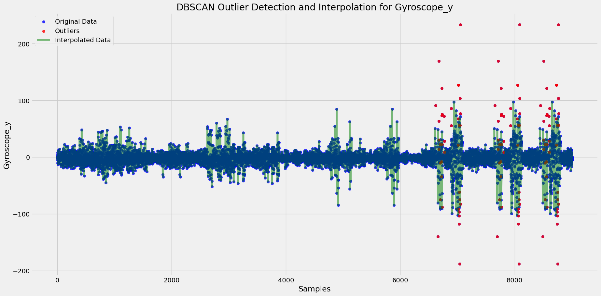
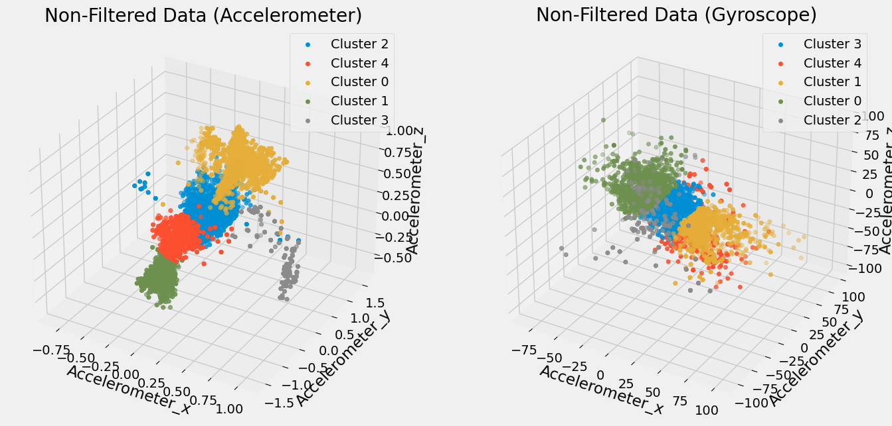
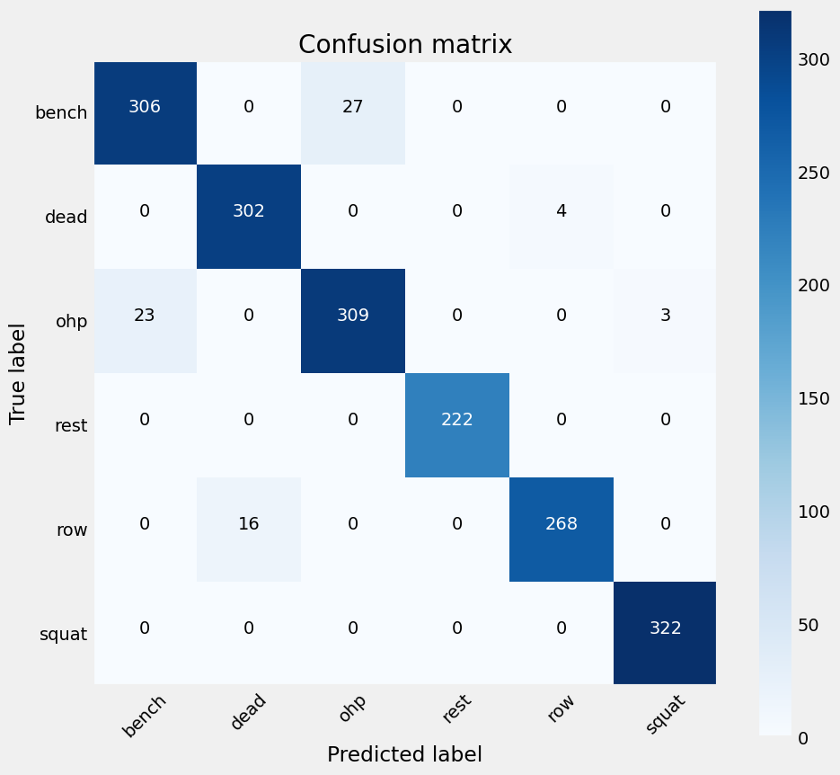
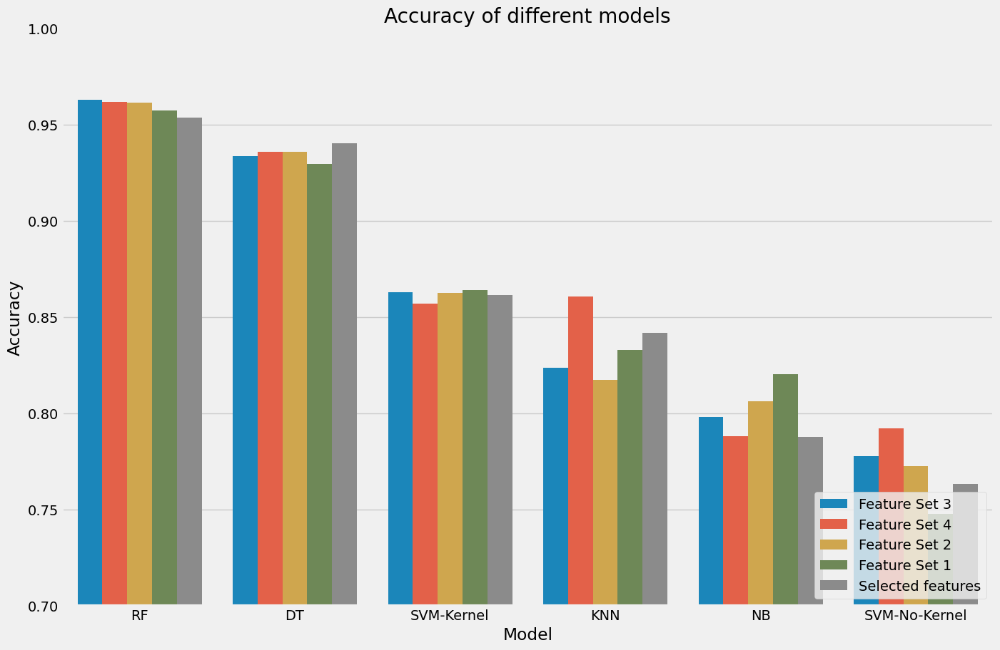

# Fitness-Tracker

## Introduction
Fitness Tracker is a time series project that focuses on activity recognition. It collects real-time data while participants perform different gym exercises. 
The goal of the project is to build a machine learning model capable of recognizing and predicting which exercise a participant is performing based on the captured data.

## Sensors
- **Accelerometer**: Tracks body movements during exercises. It captures data in three directions: X, Y, and Z axes.
- **Gyroscope**: Measures the rotation and turning movements of the body, helping to understand how fast and in which direction the body is rotating.

## Dataset
This dataset is available on Kaggle and contains accelerometer and gyroscope data collected from participants performing various gym exercises in real time. 
The data includes measurements from different sensors along the X, Y, and Z axes, recording both movement and rotational data. It also includes information about the exercise type, intensity, and the participant performing the exercise.

For more information: [Kaggle Dataset](https://www.kaggle.com/datasets/krishujeniya/fitness-tracker-accelerometer-and-gyroscope-data)

## Project Structure
The project is divided into three main parts:
1. **Outlier Detection**
   - Handling outliers using DBScan and applying interpolation to replace them.
   
2. **Feature Engineering**
   - Feature extraction, dimensionality reduction (PCA), clustering (K-means).
   ```python
   df_pca = PCA.apply_pca(df_pca, columns, n_components=3)
   ```
   
3. **Model Training & Evaluation**
   - Training and testing different machine learning models.
    
    

   
### Best Model Performance
The Random Forest model achieved the highest performance with an accuracy of 96%.


### Why does Random Forest perform better?
- Uses multiple decision trees, improving accuracy and reducing errors.
- Works well even if the sensor data has noise or fluctuations.
- Automatically selects the most relevant data for predictions.
- Does not require special data scaling or transformation.
- Prevents overfitting and handles complex movement patterns effectively.

## Improvements
- **Noise Reduction**: Applying a low-pass filter to remove noise from the accelerometer and gyroscope data.
- **Feature Transformation**: Using Fast Fourier Transform (FFT) to convert time-based data into frequency-based data, helping the model detect patterns and improve predictions.


## Run the Project
1. **Activate the Conda environment:**  
   ```bash
   conda activate your_env_name
   ```
2. **Install the required dependencies:**  
   ```bash
   pip install -r requirements.txt
   ```