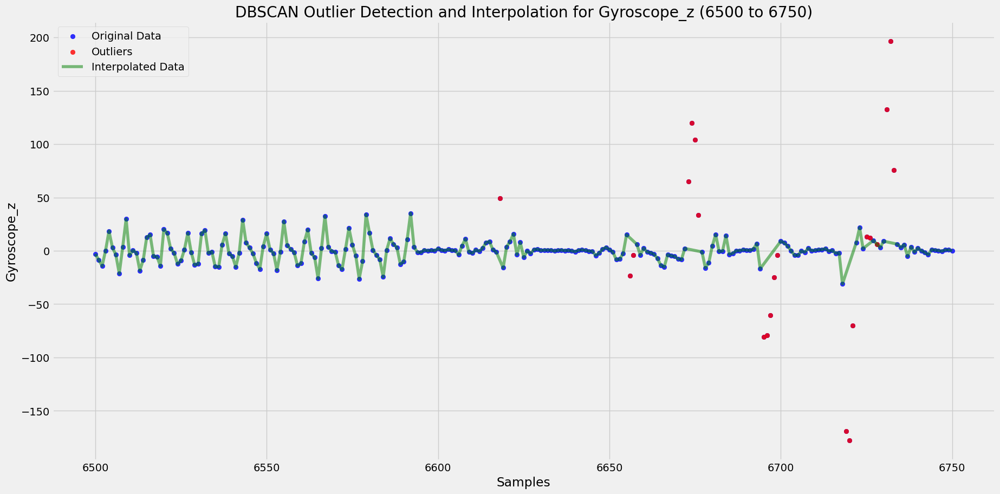
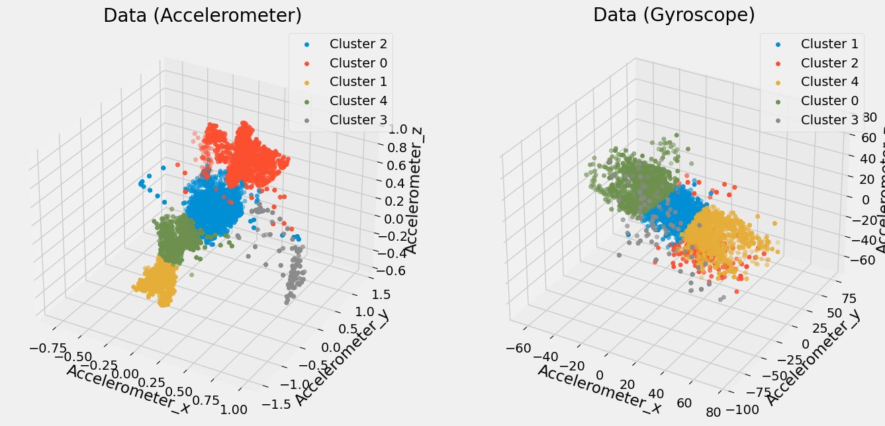

# Fitness Tracker – Activity Recognition Using Sensor Data

## Introduction
**Fitness Tracker** is a machine learning project for human activity recognition using time series sensor data. It uses accelerometer and gyroscope data collected during various gym exercises to train models that can accurately classify the type of exercise being performed.

This project demonstrates the full workflow: from data preprocessing and feature extraction to model training, evaluation, and performance comparison.

## Sensors Used
- **Accelerometer**: Measures body movement across the X, Y, and Z axes.
- **Gyroscope**: Captures rotational motion and orientation along three axes.

These sensors work together to capture a detailed picture of body motion during exercise.

## Dataset
The dataset used is publicly available on Kaggle and includes labeled sensor data from multiple gym exercises. It contains:
- 3-axis accelerometer data
- 3-axis gyroscope data
- Labels for different exercises
- Participant and intensity information

**Dataset Link**: [Kaggle Dataset](https://www.kaggle.com/datasets/krishujeniya/fitness-tracker-accelerometer-and-gyroscope-data)

## Project Workflow

### 1. Outlier Detection
- DBScan clustering is used to detect outliers in the sensor data.
- Detected outliers are replaced using interpolation for data smoothing.

Example Visualization:  


### 2. Feature Engineering
- Extracted statistical features such as mean, standard deviation, magnitude, etc.
- Applied Principal Component Analysis (PCA) to reduce dimensionality.
- Performed K-means clustering for visual inspection of patterns.

Example Code:
```python
df_pca = PCA.apply_pca(df_pca, columns, n_components=3)

kmeans = KMeans(n_clusters=5, n_init=20, random_state=0)
```

Example Visualization:  


### 3. Model Training & Evaluation
- Trained and compared multiple machine learning models:
  - Random Forest
  - Decision Tree
  - K-Nearest Neighbors
  - Logistic Regression
  - Naive Bayes
  - Support Vector Machine (Linear)

### Best Model: Random Forest
- Achieved the highest accuracy of **98%**
- Performs well with noisy sensor data
- Automatically selects important features
- Handles complex and overlapping motion patterns better than simpler models

## Potential Improvements
- **Noise Filtering**: Applied low-pass filters to smooth raw sensor signals.

## How to Run the Project

1. **Clone the repository**.

2. **Set up the environment**:
   If using Conda:
   ```bash
   conda create -n fitness-env python=3.10
   conda activate fitness-env
   ```

3. **Install dependencies**:
   ```bash
   pip install -r requirements.txt
   ```

4. **Run the notebook or script**:
   ```bash
   jupyter notebook
   ```