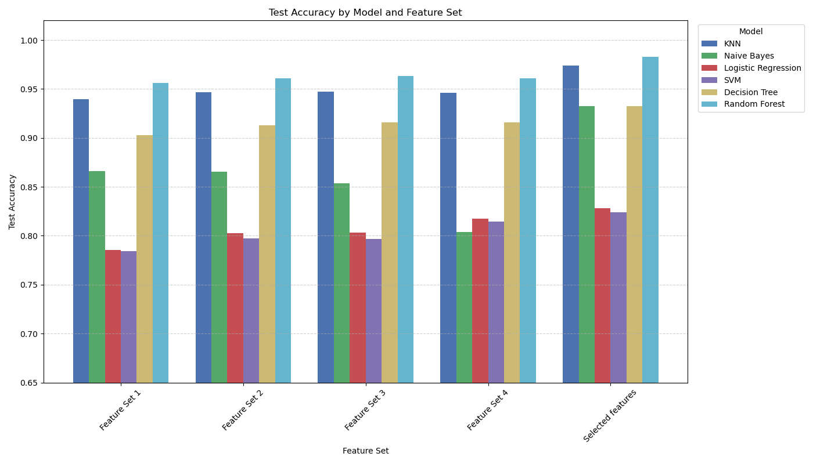
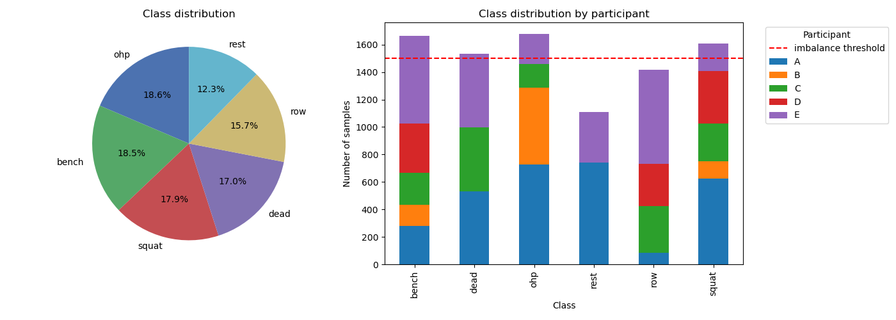
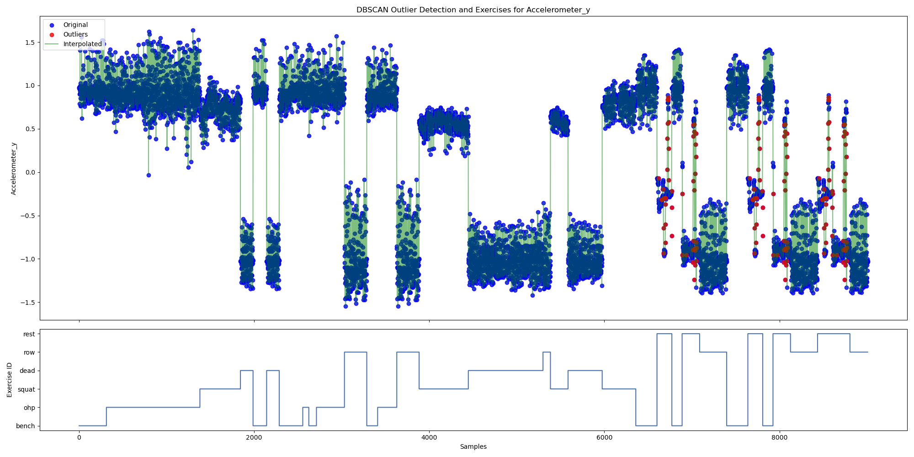
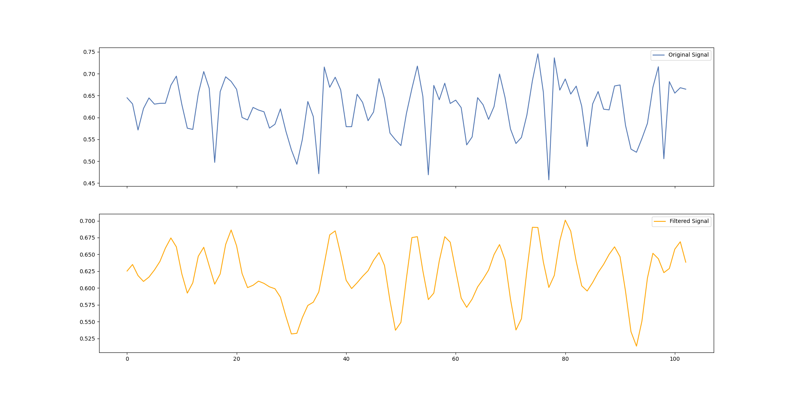
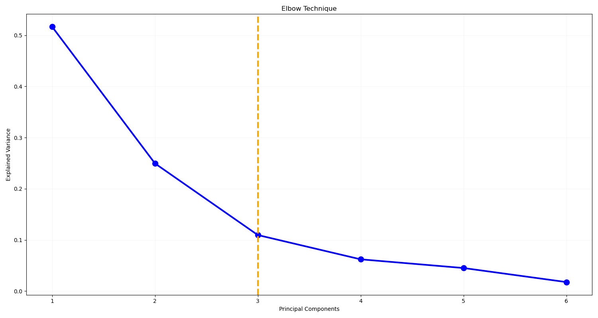
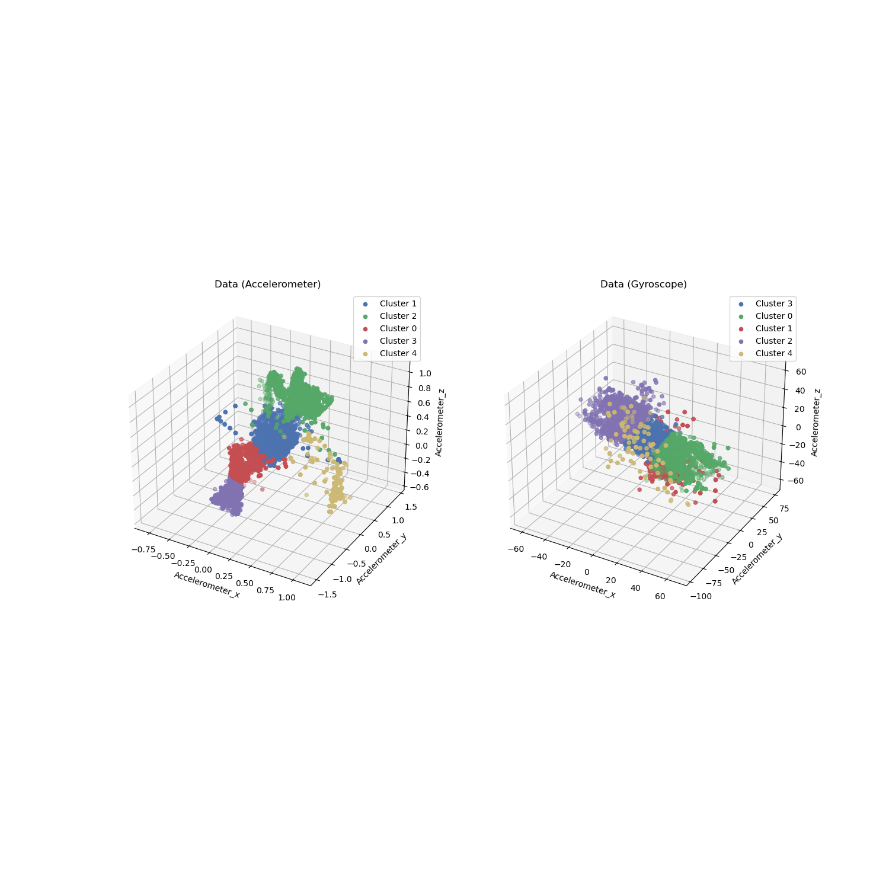
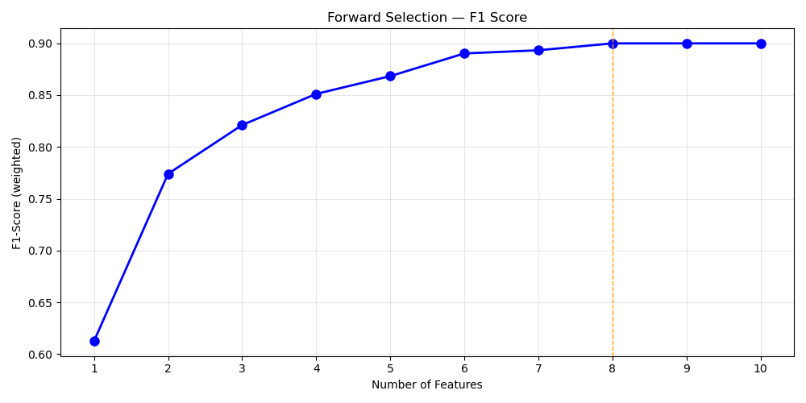

# Fitness Tracker – Exercise Recognition from Sensor Data

Classifies gym exercises (**bench, deadlift, overhead press, row, squat, rest**) from wrist-worn **accelerometer + gyroscope** data using classic machine-learning models.

**Best result: Random Forest – 98.3% test accuracy.**



## Results

Test accuracy per model, using the 8 features picked by forward selection:

| Model               | Test Accuracy |
| ------------------- | :-----------: |
| **Random Forest**   |  **98.3%**    |
| KNN                 |    97.4%      |
| Decision Tree       |    93.3%      |
| Naive Bayes         |    93.3%      |
| Logistic Regression |    82.8%      |
| SVM (linear)        |    82.4%      |

- Forward-selected features beat every hand-made feature set for all models.
- Tree-based models and KNN did best. The linear models (LR, SVM) struggle with **deadlift vs. row** because the two movements are very similar.

- **Source:** [Kaggle – Fitness Tracker Accelerometer and Gyroscope Data](https://www.kaggle.com/datasets/krishujeniya/fitness-tracker-accelerometer-and-gyroscope-data), stored in `initial_data/data.csv` (~9,000 rows).
- **Sampling rate:** one reading every 200 ms (5 Hz).
- **Columns:**
  - `Accelerometer_x/y/z`: linear acceleration.
  - `Gyroscope_x/y/z`: rotation speed.
  - `Participants`: A–E.
  - `Label`: the exercise.
  - `Category`: heavy or medium.
  - `Set`: the set number.
- Not every participant did every exercise. `rest` is its own class.



## Pipeline

The whole pipeline is in `notebooks/fitnessTracker.ipynb`. Reusable code is in `notebooks/helper/`.

### 1. Data exploration

The notebook plots the raw accelerometer and gyroscope signals for each exercise and each participant, to see how the movements differ. The results are in `img/dataset/`.

### 2. Outlier detection (DBSCAN)

- The sensor data is **not normally distributed** (confirmed with histograms), so methods based on standard deviation aren't a good fit.
- **DBSCAN** is used instead. It marks points that don't belong to any dense cluster as outliers.
- `eps` and `min_samples` were tuned with a grid search and scored with the **silhouette score**. Best settings: `eps = 1.6`, `min_samples = 7`, silhouette = 0.43.
- Outliers are set to `NaN` and filled back in with **linear interpolation**, so no rows are lost.



### 3. Low-pass filter

- A **Butterworth low-pass filter** removes high-frequency noise and keeps the repetitive exercise motion.
- Settings: order 5, sampling rate 5 Hz, cutoff 1 Hz.
- It uses `filtfilt`, which filters in both directions so the signal doesn't shift in time.



### 4. Feature engineering

| Feature | How it's built | Why it helps |
| --- | --- | --- |
| **PCA** (`pca_1..3`) | Principal Component Analysis on the 6 sensor axes. 3 components chosen with the elbow method. | Captures most of the variance in fewer dimensions. |
| **Magnitude** (`Accelerometer_r`, `Gyroscope_r`) | `r = sqrt(x² + y² + z²)` | Doesn't depend on how the device is oriented on the wrist. |
| **Rolling mean** (`*_temp_mean_ws_5`) | Mean over a 5-sample (1 second) window, computed within each set | Smooths the signal and summarises recent movement. |
| **Clusters** (`cluster_acc`, `cluster_gyro`) | K-Means (k = 5) on accelerometer data and on gyroscope data | Groups similar movement patterns without using labels. |

Missing values created by the rolling windows are filled with the column mean.

| PCA elbow | K-Means clusters |
| :---: | :---: |
|  |  |

### 5. Feature sets

Each model is trained on 5 feature sets, to see which features matter:

| Set | Features | Count |
| --- | --- | :---: |
| Set 1 | Raw sensor axes | 6 |
| Set 2 | Set 1 + magnitudes | 8 |
| Set 3 | Set 2 + PCA | 11 |
| Set 4 | Set 3 + clusters | 13 |
| **Selected** | **Forward selection**, picked from all features | 8 |

**Forward selection** starts with no features. At each step it adds the one feature that most improves a Decision Tree's F1 score, up to 10 features. The best score came at **8 features (F1 = 0.90)**:

`Accelerometer_x`, `Accelerometer_y`, `Gyroscope_z`, and the rolling means of `Accelerometer_x/y/z`, `Gyroscope_z` and `Gyroscope_r`.

The rolling-mean features weren't in any of the hand-made sets, but they turned out to be the most useful.



### 6. Modelling and evaluation

- **Split:** 70% train, 15% validation, 15% test, stratified by label.
- **Models:** KNN, Gaussian Naive Bayes, Logistic Regression, linear SVM, Decision Tree and Random Forest. All except Naive Bayes are tuned with `GridSearchCV`.
- **Evaluation:**
  - Training vs. validation accuracy, to check for overfitting.
  - Test accuracy.
  - Precision, recall and F1 for each class.
  - Confusion matrices.

## Project Structure

```
Fitness-Tracker/
├── initial_data/data.csv            raw sensor data
├── notebooks/
│   ├── fitnessTracker.ipynb         full pipeline + results
│   └── helper/
│       ├── tools.py                 DBSCAN tuning, PCA, low-pass filter, rolling mean
│       └── algorithms.py            forward selection + all classifiers
├── img/                             generated plots
│   ├── dataset/                     raw signals and class distribution
│   ├── outliers/                    boxplots, histograms, DBSCAN results
│   ├── data_extract/                filtering, PCA, clustering, correlation
│   └── models/                      accuracies, confusion matrices, comparison
├── repo_VR527645.pdf                full project report
└── requirements.txt                 exact conda environment used (macOS)
```

## How to Run

Requires Python 3.10+.

```bash
git clone https://github.com/silvergjeka22/Fitness-Tracker.git
cd Fitness-Tracker
python -m venv env && source env/bin/activate
pip install numpy pandas scipy scikit-learn matplotlib seaborn jupyter
jupyter notebook notebooks/fitnessTracker.ipynb
```

Then run all cells (**Kernel → Restart & Run All**). The notebook reads `../initial_data/data.csv` and saves its plots to `../img/`, so start it from inside the `notebooks/` folder, as the command above does.

> Note: the DBSCAN grid search tests about 150 settings and takes a few minutes.
